# Measurement details
- Localhost: Ryzen 3100
- Remote: Intel Xeon Silver 4208, somewhere in Mala Strana server room

The `/measurements` directory contains the measurements and the graphs of those measurements. Graphs were made by a `graphs.py` script and measurements were obtained by `measure.sh` script. Same graphs (edge count-wise) were used for all measurements.

# Questions + Measurements
Notation: `§ <number>` denotes the appropriate section in RMI specs: https://docs.oracle.com/javase/8/docs/platform/rmi/spec/rmiTOC.html 

## 1. Local measurement
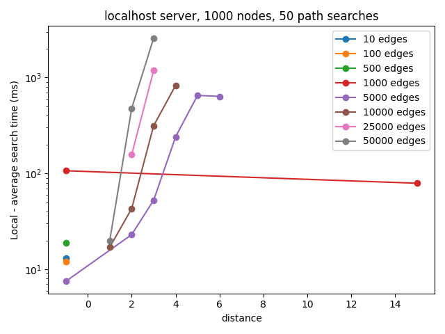

For small number of edges, no path between two random nodes was found, and the search was fast, because the nodes did not have any neighbours, thus the algorithm failed quickly. The more edges, the more time it takes to find the path (of a given distance), because the set of neighbours is also bigger. Ultimately, the more edges, the smaller the average distance is, because the graph is more interconnected. The red line (1000) edges is a bit anomalous, as it's right in the breakpoint of there being just enough edges in the graph for a path to be present, but if the path exist, it's still too long, and ultimately much of the time is spent searching in vain (thus the highest average time for a -1 distance). 

## 2. Remote Searcher
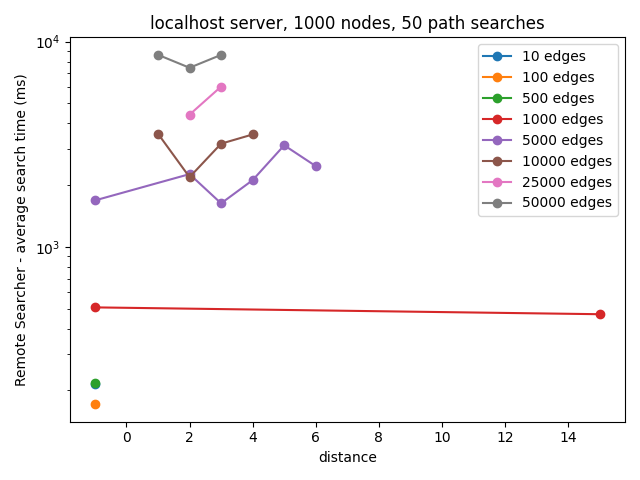

The higher density, the more time it takes to find the path, however this time the lenght of the path isn't correlated with the search time. This is because of the RMI serialization overhead; the higher the graph density is, the bigger the node objects are, and more of them are transported.

Question: **How does the server Searcher object access the Node objects and the set of their neighbors?**

§ 2.6.1: "A non-remote object, that is passed as a parameter of a remote method invocation or returned as a result of a remote method invocation, is passed by copy; that is, the object is serialized using the object serialization mechanism of the Java SE platform."

For the set of it's neighbors, the function is a getter to a property of the object, and the property was also copied as part of the object.

## 3. Remote Nodes
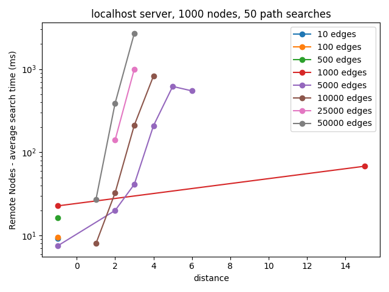

Question: **How does the local Searcher object access the server Node objects? What exactly does the NodeFactory return to the client from createNode**

Again, § 2.6.1. The nodes are obtained via remotely calling the `createNode()` method of the `NodeFactory`, which returns a serialized copy of the Node instance. The local searcher then has access to the deserialized Node instances, which for all purposes behave like a normal Node object. This explains why the graph is almost identical to the `baseline` one, because there really isn't no difference between a Node instance created locally and a Node instance created on the server and the "copied" over.

## 4. Remote Nodes and Searcher
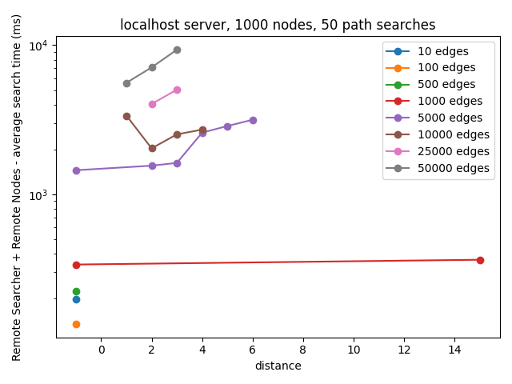

Question: **How does the server Searcher access the server Node objects (on the same server)?**

The graph is similar to the one in `Remote Searcher` section. This indicates the Searcher obtains the Nodes from the client in the same fashion. Even though the nodes were created on the server, they were serialized and sent to the client. During the search process, the nodes are serialized again and sent back to the server.

## 5. Impact of the Network

### Single machine (localhost)
See the four charts above, and their description.

### Remote machine 
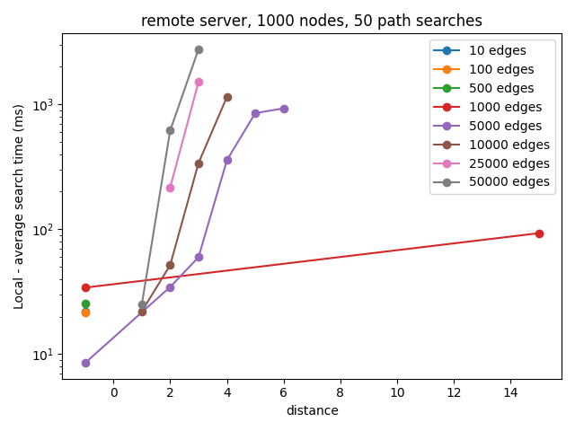
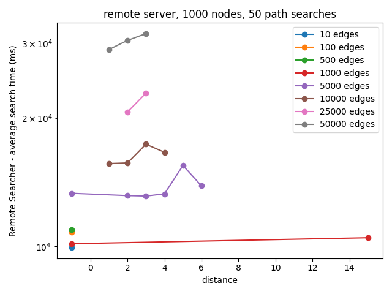
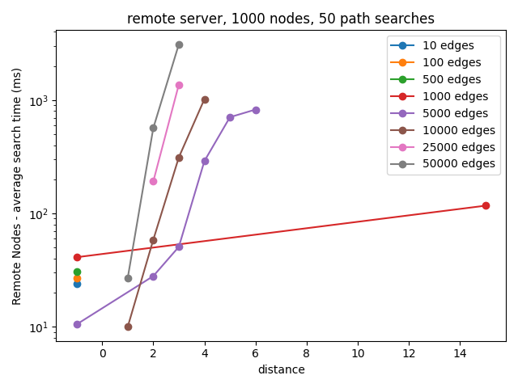
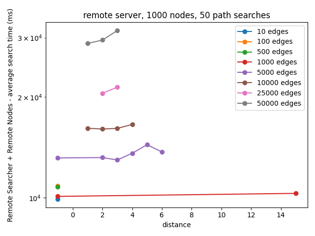

When the Nodes are serialized and present on the client (Local, Remote Nodes), there is no impact casued by the network communication. In the other two cases (Remote Searcher, Remote Searcher + Nodes), the search time goes up significantly, about 2x to 3x. The more edges, the longer the search time is, because more data has to be sent over the wire.

## 6. 

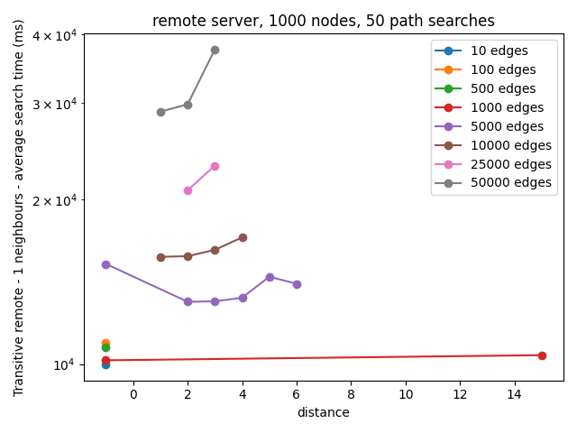
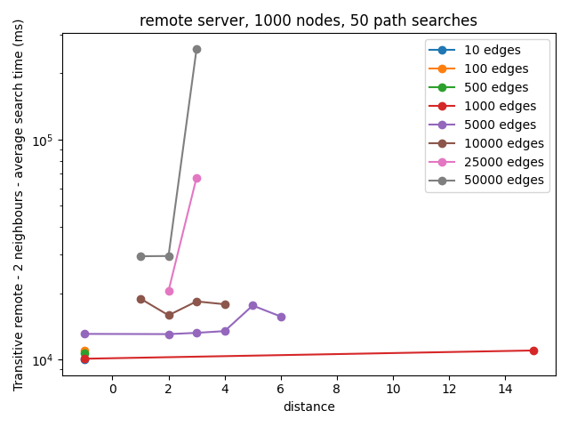
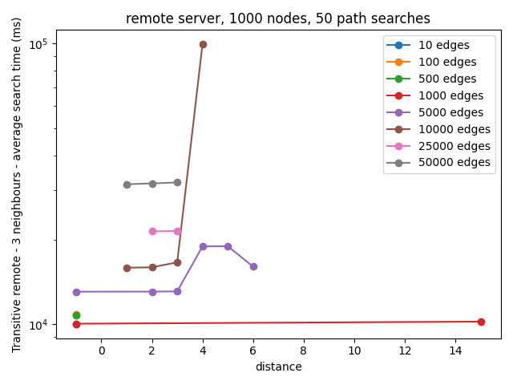
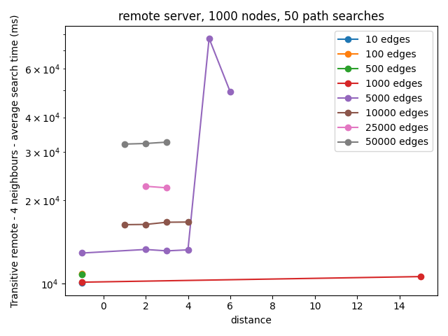
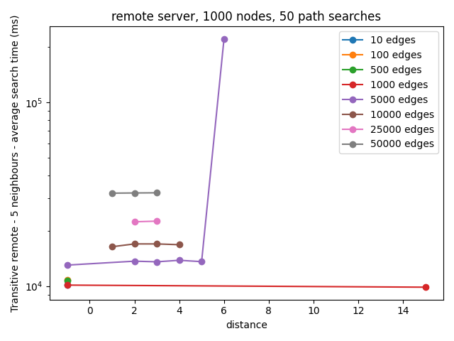
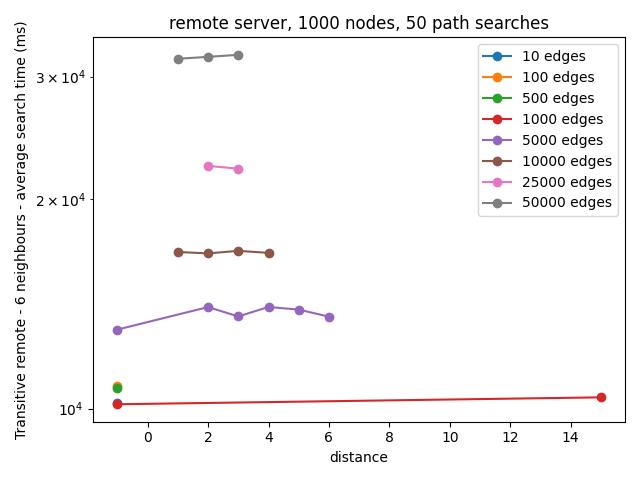

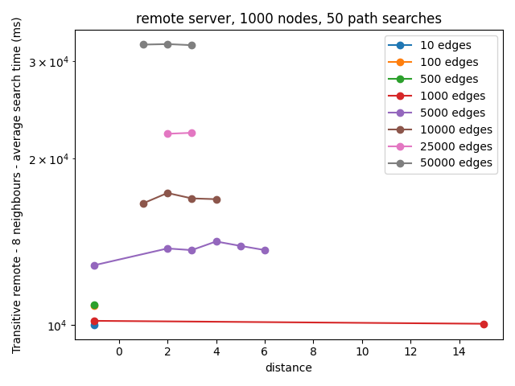
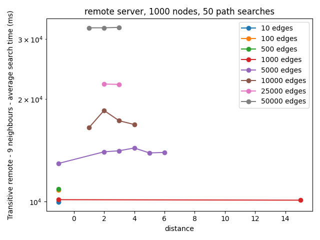

After examining the graph, it looks like `6 neighbours` is comparable.